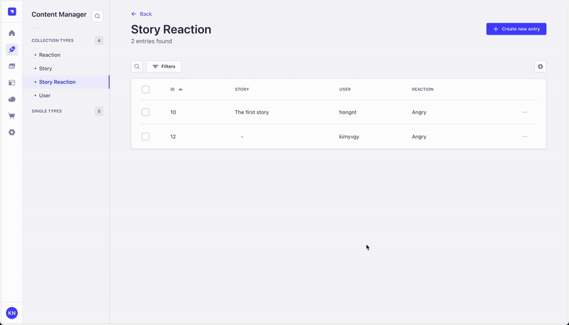

# Strapi Plugin: Required Relation Field

Enforces required relation fields in Strapi to be non-empty on save or publish.



## Installation

You just need to install the `strapi-plugin-required-relation-field` package via `npm` or `yarn` at the root of your Strapi project:

**npm:**

```bash
npm i strapi-plugin-required-relation-field
```

**yarn:**

```bash
yarn add strapi-plugin-required-relation-field
```

## Usage

Simply set `required: true` for relations in your schemas, and everything will work out-of-the-box. For example:

```json
# src/api/story-reaction/content-types/story-reaction/schema.json
{
  "kind": "collectionType",
  "collectionName": "story_reactions",
  "info": {
    "singularName": "story-reaction",
    "pluralName": "story-reactions",
    "displayName": "Story Reaction",
    "description": ""
  },
  "options": {
    "draftAndPublish": false
  },
  "attributes": {
    "story": {
      "type": "relation",
      "relation": "manyToOne",
      "target": "api::story.story",
      "inversedBy": "storyReactions",
      "required": true
    },
    "user": {
      "type": "relation",
      "relation": "manyToOne",
      "target": "plugin::users-permissions.user",
      "inversedBy": "storyReactions",
      "required": true
    },
    "reaction": {
      "type": "relation",
      "relation": "manyToOne",
      "target": "api::reaction.reaction",
      "inversedBy": "storyReactions",
      "required": true
    }
  }
}
```

## Development

To test the plugin during development, build it with the `watch:link` command:

```bash
yarn watch:link
```

Next, link it to a local Strapi project. In a new terminal window, run:

```bash
cd /path/to/strapi/project
yarn dlx yalc add --link strapi-plugin-required-relation-field
yarn install
```

Since this plugin is installed via `node_modules`, you don't need to explicitly add it to your `plugins` configuration file. Running the `develop` command will automatically detect your plugin.

Start your Strapi project with:

```bash
yarn develop
```

You are now ready to develop your plugin! Note that server changes require a server restart to take effect.
